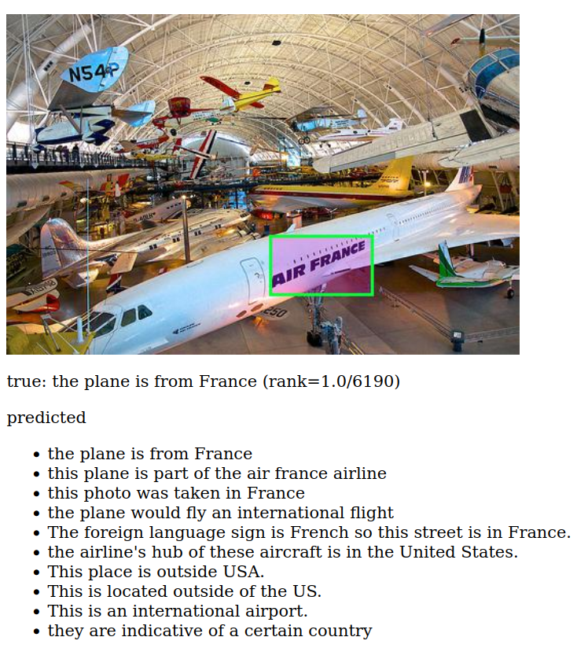
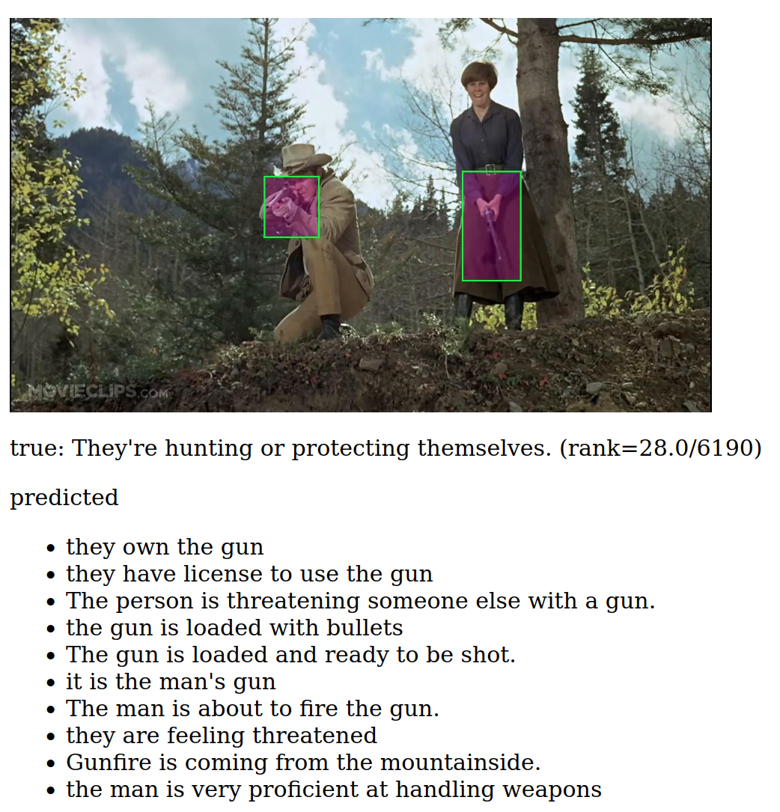
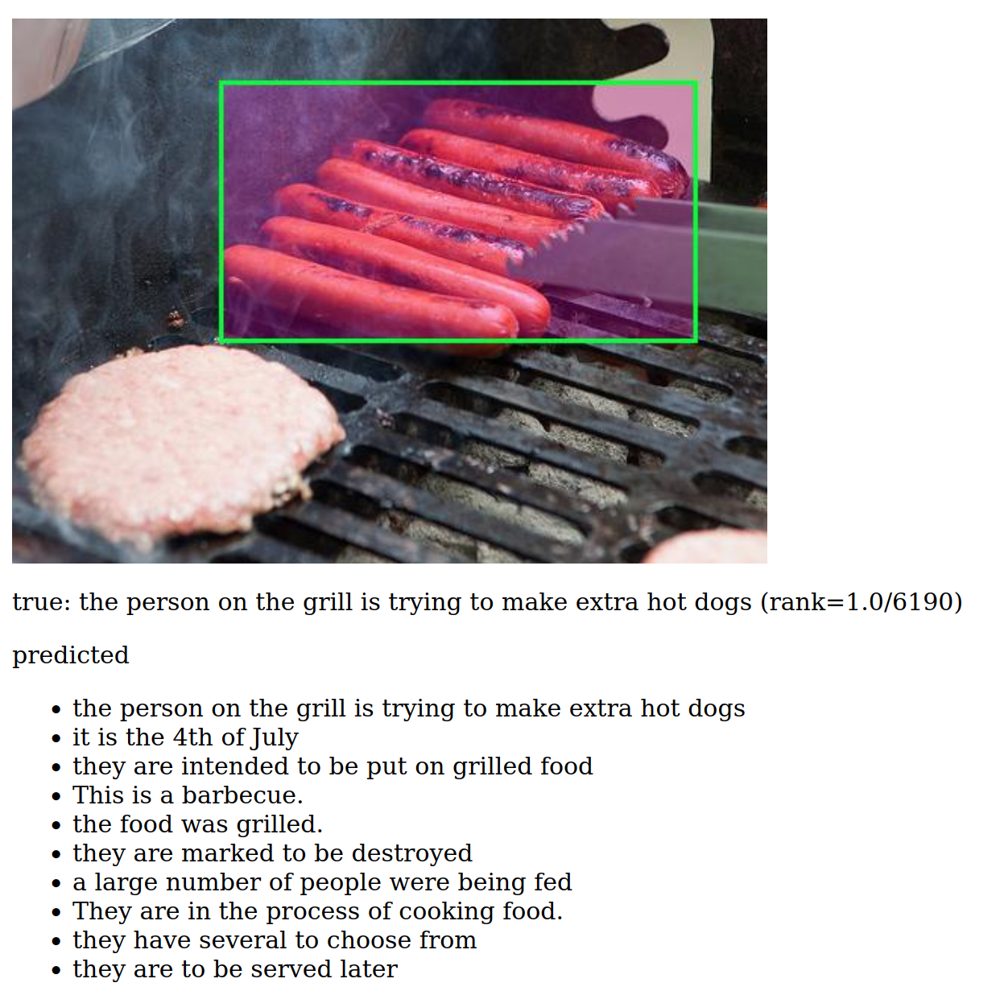

<h1><strong><center>SHERLOCK: A Study in Visual Abductive Reasoning</center></strong></h1>

### What is Sherlock?

We collected a large corpus of *abductive inferences* over
images. Abductive reasoning is the act of reasoning about plausible
inferences in the case of uncertianty. Our corpus consists of 383K
inferences across 108K images. Each inference is grounded in images via a bounding box.
Our model predicts an abductive inference given an image and a bounding box. Example
predictions of our best performing model, generated by the scripts in this repo,
are given here:

<p align="center">
  
</p>

<p align="center">
  
</p>

<p align="center">
  
</p>

A full, true random sample of predictions is given
[here.](https://jmhessel.com/projects/sherlock/darpa_self_eval_examples.html)
The outputs are also available in tsv/html format in this repo under `outputs_human_readable/`.

## How to run the code?

There are 5 scripts, which can all be run by executing `./run_all.sh`. They do the following:

1. Download the model/data.
2. Run the prediction script which runs the model on the data (a GPU really helps speed!)
3. Run automatic evaluations on the predictions.
4. Run human correlation results.
5. Run exploration script that outputs human readable predictions

There's also a dockerfile included with this repo which will built an
environment for the code to run. It can be built with

```
docker build . -t sherlock_docker_selfeval
```

depending on which GPU you are using, you can run with:
```
docker run  --gpus '"device=0"' sherlock_docker_selfeval
```

or, if you want to drop into the bash shell:
```
docker run --gpus '"device=0"' -it --entrypoint bash sherlock_docker_selfeval
```

Then, to run in docker, you can do 

### How is the model evaluated?

We evaluate our model using both automatic metrics and using correlation with human judgement.

#### Automatic metrics
**Automatic metrics** measure the capacity of the model to search for
plausible inferences across over a large number of candidates. Each
image/bounding box has a corresponding inference that an annotator
authored specific to that image/bounding box. As a result, we can
measure the model's performance in retrieving the ground-truth
annotated inference from a large set of inferences via standard
retrieval metrics. The code in this repo computes retrievals over 1024
candidates.  For this subset of our corpus, the following automatic
metrics are compared to a UNITER-Large baseline that we fine-tuned on
Sherlock.

```
im2txt: 19.05 (lower better, UNITER-Large baseline=72.6)
txt2im: 21.93 (lower better, UNITER-Large baseline=64.7)
im2txt p@1: 31.93 (higher better, UNITER-Large baseline=11.7)
robertascoref_hardmode: 25.55 (higher better, UNITER-Large baseline=18.7)
```

- `im2txt` is the mean rank of true inference annotation when the query is the image/bounding box (lower=better).
- `txt2im` is the bidirectional counterpart, it reports the performance of a search over images (lower=better).
- `im2txt p@1` is the percentage of the time that the top predicted inference is the ground-truth annotation across the 1024 candidates (higher=better).
- `robertascoref_hardmode` is a "soft" metric that computes the semantic similarity between the top retrieved inference and the ground truth inference (higher=better).

In all cases, our CLIP based model outperforms UNITER-Large.

#### Human Judgement Correlation

Retrieval metrics provide some perspective on how well the model is
able to retrieve the ground-truth annotations from a large corpus. But
--- not all mistakes are equally reasonable, e.g., from the example
above with the Air France plane, the inference ``This photo is taken
in France" is less reasonable than ``This plane would fly an
international flight." because the plane is in a museum. To quantify
human-judged reasonability of our retrieved inferences, we collect 20K
additional likert-style annotations where humans rated the quality of
particular inferences. Then, we compute the accuracy of our model in
reconstructing those likert judgments using a pairwise accuracy
cirteria.  `run_human_eval.py` contains the `pairwise_acc` function
which contains the precise definition of this metric. Higher is
better, and we report the human agreement (to serve as an upper bound)
and the performance of a random predictor (to serve as a lower bound).

```
Human Agreement (upper bound): 42.22
Our Model corr: 21.83
UNITER-Large Baseline: 18.7
Random corr (lower bound): 1.20
```

While our model outperforms a strong UNITER-Large baseline, there is
significant headroom between our model and human performance, which
sets the stage for future work.
